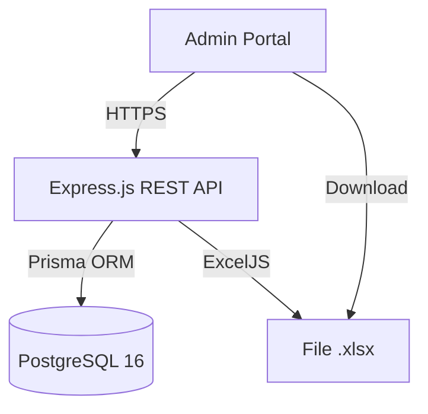
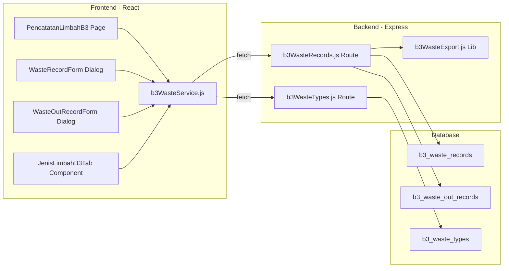
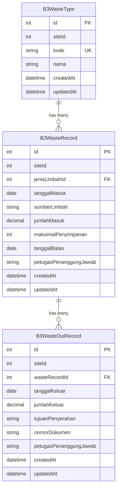

# Design Document: Pencatatan Limbah B3

## Overview

Modul Pencatatan Limbah B3 menyediakan fitur CRUD lengkap untuk mengelola data limbah B3 masuk dan keluar TPS, dengan monitoring batas penyimpanan dan ekspor data untuk audit regulasi. Modul ini terintegrasi ke dalam Aplikasi Hub Karyawan yang sudah ada, mengikuti pola arsitektur domain-based pages di frontend dan resource-based routes di backend.

### Keputusan Desain Utama

1. **Single table approach untuk pencatatan**: Menggunakan satu tabel `B3WasteRecord` yang menyimpan data limbah masuk, dan tabel terpisah `B3WasteOutRecord` untuk pencatatan keluar. Satu record masuk bisa memiliki banyak record keluar (one-to-many).
2. **Computed columns di backend**: Sisa limbah dan sisa hari dihitung di server-side saat query, tidak disimpan sebagai kolom terpisah. Ini mencegah data inconsistency.
3. **Master data sebagai tab baru**: Jenis Limbah B3 ditambahkan sebagai tab baru pada halaman Master Data Dokumen yang sudah ada, mengikuti pola tab yang sudah diimplementasikan.
4. **Server-side pagination & sorting**: Mengikuti pola DataGrid yang sudah ada di aplikasi dengan pagination dan sorting dari server.

## Architecture

### System Context Diagram



### Component Architecture



### API Endpoints

| Method | Path | Description |
|--------|------|-------------|
| GET | `/api/b3-waste/records` | Daftar pencatatan limbah (paginated, sorted) |
| POST | `/api/b3-waste/records` | Tambah pencatatan limbah masuk |
| PUT | `/api/b3-waste/records/:id` | Edit pencatatan limbah masuk |
| DELETE | `/api/b3-waste/records/:id` | Hapus pencatatan limbah masuk |
| POST | `/api/b3-waste/records/:id/out` | Tambah pencatatan limbah keluar |
| PUT | `/api/b3-waste/out-records/:id` | Edit pencatatan limbah keluar |
| DELETE | `/api/b3-waste/out-records/:id` | Hapus pencatatan limbah keluar |
| GET | `/api/b3-waste/export` | Ekspor data ke Excel |
| GET | `/api/b3-waste/types` | Daftar jenis limbah B3 (master data) |
| POST | `/api/b3-waste/types` | Tambah jenis limbah B3 |
| PUT | `/api/b3-waste/types/:id` | Edit jenis limbah B3 |
| DELETE | `/api/b3-waste/types/:id` | Hapus jenis limbah B3 |

### Middleware Chain

```
requireAdminAuth → requireSiteIsolation → route handler
```

Semua endpoint menggunakan `requireAdminAuth` untuk autentikasi dan `requireSiteIsolation` untuk memastikan data terisolasi per site.

## Components and Interfaces

### Frontend Components

#### 1. PencatatanLimbahB3 (Page Component)
- **Path**: `src/pages/employeeData/pencatatanLimbahB3/PencatatanLimbahB3.jsx`
- **Responsibilities**: Menampilkan DataGrid dengan daftar pencatatan, tombol tambah, edit, hapus, dan ekspor
- **State**: pagination, sorting, loading, data records
- **Props**: None (page-level component)

#### 2. WasteRecordForm (Dialog Component)
- **Path**: `src/pages/employeeData/pencatatanLimbahB3/WasteRecordForm.jsx`
- **Responsibilities**: Form pencatatan limbah masuk (create/edit) dalam dialog modal
- **Props**: `open`, `onClose`, `onSuccess`, `editData` (null for create)
- **Form fields**: jenisLimbahId (dropdown), tanggalMasuk (date picker), sumberLimbah (text), jumlahMasuk (numeric), maksimalPenyimpanan (dropdown 90/180), petugasPenanggungJawab (text, auto-filled)

#### 3. WasteOutRecordForm (Dialog Component)
- **Path**: `src/pages/employeeData/pencatatanLimbahB3/WasteOutRecordForm.jsx`
- **Responsibilities**: Form pencatatan limbah keluar dalam dialog modal
- **Props**: `open`, `onClose`, `onSuccess`, `wasteRecord` (parent record), `editData` (null for create)
- **Form fields**: tanggalKeluar (date picker), jumlahKeluar (numeric), tujuanPenyerahan (text), nomorDokumen (text), petugasPenanggungJawab (text, auto-filled)

#### 4. JenisLimbahB3Tab (Tab Component)
- **Path**: `src/pages/masterData/masterDokumen/JenisLimbahB3Tab.jsx`
- **Responsibilities**: Tab baru pada halaman Master Data Dokumen untuk CRUD jenis limbah B3
- **Props**: Standard tab props dari parent Master Data Dokumen page

#### 5. DeleteConfirmDialog (Shared Component)
- **Reuse**: Menggunakan komponen dialog konfirmasi yang sudah ada di aplikasi

### Backend Route Handlers

#### 1. b3WasteRecords.js
- **Path**: `server/routes/b3WasteRecords.js`
- **Exports**: `Router()` instance
- **Endpoints**: CRUD untuk waste records + waste out records + export
- **Validation**: Yup schemas inline

#### 2. b3WasteTypes.js
- **Path**: `server/routes/b3WasteTypes.js`
- **Exports**: `Router()` instance
- **Endpoints**: CRUD untuk master data jenis limbah B3
- **Validation**: Yup schemas inline

### Service Layer

#### b3WasteService.js
- **Path**: `src/services/b3WasteService.js`
- **Functions**:
  - `getWasteRecords(siteId, params)` — GET daftar dengan pagination/sorting
  - `createWasteRecord(siteId, data)` — POST limbah masuk
  - `updateWasteRecord(siteId, id, data)` — PUT edit limbah masuk
  - `deleteWasteRecord(siteId, id)` — DELETE limbah masuk
  - `createWasteOutRecord(siteId, recordId, data)` — POST limbah keluar
  - `updateWasteOutRecord(siteId, id, data)` — PUT edit limbah keluar
  - `deleteWasteOutRecord(siteId, id)` — DELETE limbah keluar
  - `exportWasteRecords(siteId, params)` — GET export Excel (blob)
  - `getWasteTypes(siteId, params)` — GET daftar jenis limbah
  - `createWasteType(siteId, data)` — POST jenis limbah baru
  - `updateWasteType(siteId, id, data)` — PUT edit jenis limbah
  - `deleteWasteType(siteId, id)` — DELETE jenis limbah

## Data Models

### Prisma Schema

```prisma
model B3WasteType {
    id        Int      @id @default(autoincrement())
    siteId    Int
    kode      String   @db.VarChar(20)
    nama      String   @db.VarChar(200)
    createdAt DateTime @default(now())
    updatedAt DateTime @updatedAt

    wasteRecords B3WasteRecord[]

    @@unique([siteId, kode])
    @@map("b3_waste_types")
}

model B3WasteRecord {
    id                    Int      @id @default(autoincrement())
    siteId                Int
    jenisLimbahId         Int
    tanggalMasuk          DateTime @db.Date
    sumberLimbah          String   @db.VarChar(200)
    jumlahMasuk           Decimal  @db.Decimal(10, 2)
    maksimalPenyimpanan   Int      // 90 or 180
    tanggalBatas          DateTime @db.Date
    petugasPenanggungJawab String  @db.VarChar(100)
    createdAt             DateTime @default(now())
    updatedAt             DateTime @updatedAt

    jenisLimbah  B3WasteType       @relation(fields: [jenisLimbahId], references: [id])
    outRecords   B3WasteOutRecord[]

    @@map("b3_waste_records")
}

model B3WasteOutRecord {
    id                    Int      @id @default(autoincrement())
    siteId                Int
    wasteRecordId         Int
    tanggalKeluar         DateTime @db.Date
    jumlahKeluar          Decimal  @db.Decimal(10, 2)
    tujuanPenyerahan      String   @db.VarChar(200)
    nomorDokumen          String   @db.VarChar(100)
    petugasPenanggungJawab String  @db.VarChar(100)
    createdAt             DateTime @default(now())
    updatedAt             DateTime @updatedAt

    wasteRecord  B3WasteRecord @relation(fields: [wasteRecordId], references: [id])

    @@map("b3_waste_out_records")
}
```

### Entity Relationship Diagram



### Computed Fields (calculated at query time)

| Field | Formula | Description |
|-------|---------|-------------|
| `sisaLimbah` | `jumlahMasuk - SUM(outRecords.jumlahKeluar)` | Sisa limbah di TPS per record |
| `sisaHari` | `tanggalBatas - today()` | Sisa hari sebelum batas penyimpanan |
| `statusPenyimpanan` | Based on `sisaHari` and `sisaLimbah` | `normal` / `warning` / `overdue` |

### API Response Shapes

#### GET /api/b3-waste/records Response

```json
{
    "data": [
        {
            "id": 1,
            "jenisLimbah": { "id": 1, "kode": "A338-1", "nama": "Bahan kimia kedaluwarsa" },
            "tanggalMasuk": "2024-01-15",
            "sumberLimbah": "Warehouse",
            "jumlahMasuk": 150.75,
            "maksimalPenyimpanan": 90,
            "tanggalBatas": "2024-04-14",
            "petugasPenanggungJawab": "Ahmad Fauzi",
            "outRecords": [
                {
                    "id": 1,
                    "tanggalKeluar": "2024-02-01",
                    "jumlahKeluar": 50.00,
                    "tujuanPenyerahan": "Pengolahan",
                    "nomorDokumen": "MNF/2024/001",
                    "petugasPenanggungJawab": "Ahmad Fauzi"
                }
            ],
            "sisaLimbah": 100.75,
            "sisaHari": 45,
            "statusPenyimpanan": "normal"
        }
    ],
    "total": 50,
    "page": 0,
    "pageSize": 25
}
```

### Validation Rules Summary

| Field | Type | Rules |
|-------|------|-------|
| jenisLimbahId | Integer | Required, must exist in B3WasteType for same siteId |
| tanggalMasuk | Date | Required, min: 2020-01-01, max: today |
| sumberLimbah | String | Required, max 200 chars |
| jumlahMasuk | Decimal | Required, min: 0.01, max: 999999.99, precision: 2 |
| maksimalPenyimpanan | Integer | Required, enum: [90, 180] |
| petugasPenanggungJawab | String | Required, max 100 chars |
| tanggalKeluar | Date | Required, min: tanggalMasuk of parent, max: today |
| jumlahKeluar | Decimal | Required, min: 0.01, max: sisaLimbah, precision: 2 |
| tujuanPenyerahan | String | Required, max 200 chars |
| nomorDokumen | String | Required, max 100 chars |
| kode (waste type) | String | Required, max 20 chars, unique per siteId |
| nama (waste type) | String | Required, max 200 chars |

## Correctness Properties

*A property is a characteristic or behavior that should hold true across all valid executions of a system — essentially, a formal statement about what the system should do. Properties serve as the bridge between human-readable specifications and machine-verifiable correctness guarantees.*

### Property 1: Waste Record Creation Round-Trip

*For any* valid waste record input (jenisLimbahId, tanggalMasuk, sumberLimbah, jumlahMasuk, maksimalPenyimpanan, petugasPenanggungJawab), creating the record and then reading it back SHALL return data identical to the input, with `tanggalBatas` correctly computed as `tanggalMasuk + maksimalPenyimpanan` days.

**Validates: Requirements 1.1, 1.8**

### Property 2: Validation Rejects Invalid or Incomplete Inputs

*For any* waste record input where at least one required field is missing, empty, or has an invalid value (jumlahMasuk outside 0.01–999999.99, more than 2 decimal places, tanggalMasuk outside allowed range), the system SHALL reject the input with a validation error and no record SHALL be persisted.

**Validates: Requirements 1.7, 1.9, 2.8**

### Property 3: Remaining Waste Accounting Invariant

*For any* waste record with a set of associated out-records, the computed `sisaLimbah` SHALL always equal `jumlahMasuk - SUM(outRecords.jumlahKeluar)` with 2 decimal precision. At the aggregate level per waste type per site, total remaining waste SHALL equal `SUM(jumlahMasuk) - SUM(jumlahKeluar)` across all records of that type.

**Validates: Requirements 2.7, 3.1**

### Property 4: Cannot Exceed Remaining Waste

*For any* waste record, if a new outgoing record is submitted with `jumlahKeluar` exceeding the current `sisaLimbah` (jumlahMasuk minus sum of all existing out-records), the system SHALL reject the operation and no out-record SHALL be persisted.

**Validates: Requirements 2.6**

### Property 5: Storage Status Classification

*For any* waste record, given a reference date:
- If `sisaLimbah <= 0`, the status SHALL be `normal` (no indicator) regardless of `sisaHari`
- If `sisaLimbah > 0` and `sisaHari > 14`, the status SHALL be `normal`
- If `sisaLimbah > 0` and `1 <= sisaHari <= 14`, the status SHALL be `warning`
- If `sisaLimbah > 0` and `sisaHari <= 0`, the status SHALL be `overdue`

Where `sisaHari = (tanggalMasuk + maksimalPenyimpanan) - referenceDate`

**Validates: Requirements 4.1, 4.2, 4.3, 4.4, 4.6**

### Property 6: Indonesian Number Formatting

*For any* valid decimal number, the formatting function SHALL produce a string with dot (`.`) as thousands separator and comma (`,`) as decimal separator, with exactly 2 decimal places (e.g., input `1250.5` → output `"1.250,50"`).

**Validates: Requirements 3.4**

### Property 7: Site Isolation Invariant

*For any* API request with a given `siteId`:
- All records returned by read operations SHALL have `siteId` matching the requesting admin's active site
- All newly created records SHALL have `siteId` automatically set to the admin's active site
- Update and delete operations on records with a different `siteId` SHALL be rejected with an access denied error

**Validates: Requirements 5.4, 10.1, 10.2, 10.3, 10.4**

### Property 8: Referential Integrity Prevents Deletion

*For any* B3WasteRecord that has one or more associated B3WasteOutRecord entries, deletion SHALL be rejected. Similarly, *for any* B3WasteType that is referenced by one or more B3WasteRecord entries, deletion SHALL be rejected.

**Validates: Requirements 6.6, 7.7**

### Property 9: Field Immutability After Save

*For any* saved B3WasteRecord or B3WasteOutRecord, the `petugasPenanggungJawab` field SHALL not be modifiable via update operations. Similarly, *for any* saved B3WasteType, the `kode` field SHALL not be modifiable via update operations.

**Validates: Requirements 7.4, 8.2**

### Property 10: Sorting Correctness

*For any* list of waste records and a valid sort field (tanggalMasuk or tanggalBatas) with direction (asc/desc), the returned records SHALL be ordered such that for consecutive records `a[i]` and `a[i+1]`, the sort field value of `a[i]` is ≤ (ascending) or ≥ (descending) `a[i+1]`.

**Validates: Requirements 5.3**

### Property 11: Unique Waste Type Code Per Site

*For any* site, attempting to create a B3WasteType with a `kode` that already exists for that same `siteId` SHALL be rejected. Codes in different sites SHALL be allowed to coexist.

**Validates: Requirements 7.5**

## Error Handling

### Backend Error Strategy

| Error Type | HTTP Status | Response | Handling |
|-----------|-------------|----------|----------|
| Validation error (Yup) | 400 | `{ message: "Pesan validasi spesifik" }` | Yup schema validation inline di route |
| Record not found | 404 | `{ message: "Data tidak ditemukan" }` | Prisma query returns null check |
| Duplicate kode | 409 | `{ message: "Kode limbah sudah terdaftar" }` | Prisma P2002 unique constraint |
| Foreign key constraint (delete blocked) | 409 | `{ message: "Data tidak dapat dihapus karena masih digunakan" }` | Prisma P2003 or pre-check |
| Site isolation violation | 403 | `{ message: "Akses tidak diizinkan" }` | `requireSiteIsolation` middleware |
| Missing siteId | 400 | `{ message: "siteId diperlukan" }` | `requireSiteIsolation` middleware |
| Exceed remaining waste | 400 | `{ message: "Jumlah limbah keluar tidak boleh melebihi sisa limbah di TPS" }` | Business logic check before save |
| Server error | 500 | `{ message: "Terjadi kesalahan pada server" }` | Global error handler |

### Frontend Error Strategy

| Scenario | UI Behavior |
|----------|-------------|
| Form validation error | Inline error messages di bawah field menggunakan Formik + Yup |
| API 400 (validation) | Snackbar error dengan pesan dari server |
| API 403 (forbidden) | Snackbar error "Akses tidak diizinkan" |
| API 404 (not found) | Snackbar error + refresh data tabel |
| API 409 (conflict) | Snackbar error dengan pesan spesifik dari server |
| API 500 (server error) | Snackbar error "Terjadi kesalahan pada server" |
| Network error | Snackbar error "Gagal terhubung ke server" + tombol retry |
| Empty state | Pesan informatif "Belum ada data pencatatan limbah B3" |
| Loading state | Skeleton/loading indicator pada DataGrid |

### Optimistic vs Pessimistic Updates

Menggunakan **pessimistic updates**: UI menunggu konfirmasi dari server sebelum memperbarui tampilan. Setelah berhasil, data di-refetch untuk memastikan konsistensi (termasuk computed fields seperti sisaLimbah dan sisaHari).

## Testing Strategy

### Property-Based Testing

Library: **fast-check** (via Vitest)

Setiap property test dikonfigurasi dengan minimum 100 iterasi. Tag format: `Feature: b3-waste-recording, Property {number}: {title}`

**Properties to implement:**

1. **Waste record creation round-trip** — Generate random valid inputs, create record, verify read-back matches input + computed tanggalBatas
2. **Validation rejection** — Generate random invalid inputs (missing fields, out-of-range values), verify rejection
3. **Remaining waste accounting** — Generate random sequences of in/out records, verify sisaLimbah computation
4. **Cannot exceed remaining** — Generate outgoing amounts > remaining, verify rejection
5. **Storage status classification** — Generate random (sisaHari, sisaLimbah) pairs, verify correct status
6. **Indonesian number formatting** — Generate random decimals, verify formatting output
7. **Site isolation** — Generate records with different siteIds, verify isolation holds on queries
8. **Referential integrity** — Generate parent records with children, verify deletion blocked
9. **Field immutability** — Create records, attempt to update immutable fields, verify rejection
10. **Sorting correctness** — Generate random record sets, verify sort order
11. **Unique kode per site** — Generate duplicate kode attempts within same site, verify rejection

### Unit Testing (Example-Based)

| Area | Focus |
|------|-------|
| Form rendering | Verify all fields render with correct types and constraints |
| Date picker configuration | Verify min/max date boundaries |
| Dropdown options | Verify master data loaded as options |
| Auto-fill petugas | Verify logged-in user name populated |
| Edit form population | Verify existing data pre-fills form |
| Delete confirmation dialog | Verify dialog shows record identity |
| Loading/empty/error states | Verify correct UI states |
| Export filename format | Verify date-based naming |
| Excel header content | Verify license number in first row |

### Integration Testing

| Area | Focus |
|------|-------|
| API endpoint CRUD | Full lifecycle: create → read → update → delete |
| Pagination | Verify page/pageSize parameters work correctly |
| Cross-site access | Verify 403 when accessing other site's data |
| Concurrent modification | Verify 404 handling for stale records |
| Excel export | Verify file generation with correct content |
| Master data cascade | Verify waste type deletion blocked when in use |

