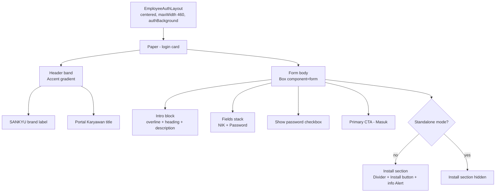

# Design Document

## Overview

This design describes a visual redesign (restyle) of the existing employee mobile login page at
`app-karyawan/src/pages/employeeMobile/login/index.jsx`. The goal is a cleaner, more minimalist and modern
presentation while preserving every piece of content, all functionality, the blue brand identity, mobile-first
responsiveness, light/dark theme support, and accessibility baselines.

This is strictly a presentation-layer change. The component's React state, event handlers, network calls, form
field names, navigation, and PWA install logic remain byte-for-byte behaviorally identical. The only changes are to
the JSX structure used for layout and the `sx` styling props that control spacing, typography hierarchy, surface
treatment, and visual emphasis. No new dependencies, no new component types, and no new color values are introduced.

### Goals

- Reduce visual clutter and improve readability through consistent 8px-based spacing and a clearer typographic
  hierarchy.
- Keep 100% of existing content elements and behaviors (Requirements 1 and 2).
- Source all accent, surface, border, and shadow colors exclusively from existing theme tokens and the established
  header/button gradients (Requirement 3).
- Stay within the existing MUI v5 component set (Requirement 4.6).
- Remain mobile-first and responsive across 320px–1024px (Requirement 5).
- Render correctly in both light and dark mode using theme tokens (Requirement 6).
- Meet accessibility baselines for contrast, focus visibility, and touch-target size (Requirement 7).

### Non-Goals

- No change to authentication logic, `employeeAuthRequest`, or the `useEmployeeAuth` context.
- No change to form field names (`nik`, `password`), validation, or autocomplete attributes.
- No change to PWA install detection (`beforeinstallprompt`, `appinstalled`, `display-mode: standalone`).
- No change to navigation (`redirectTo`) or snackbar messaging behavior.
- No change to the theme palette, theme tokens, or the surrounding `EmployeeAuthLayout`.

### Context From Existing Code

Confirmed by reviewing the current implementation and theme:

- The page is a single `Paper` rendered as the `Outlet` of `EmployeeAuthLayout`
  (`src/components/layouts/employeeAuthLayout/index.jsx`), which already centers content, applies `px: 2, py: 3`,
  constrains width to `maxWidth: 460`, and paints the `employeeSurface.authBackground` gradient. The redesign keeps
  this wrapper untouched and continues to render a full-width `Paper` inside it.
- Theme tokens live in `src/utils/theme/employeePortalTheme.js`:
  - `palette.primary.main = '#3A93F2'`, `palette.primary.dark = '#266FB6'`.
  - `palette.employeeSurface.{card, borderSoft, borderStrong, muted, soft, shadowSoft, shadowMedium, shadowFloating,
    cardGradient, heroGradient, glass}` are defined per mode.
  - `palette.background.paper` is `#FFFFFF` (light) / `#152132` (dark).
  - `shape.borderRadius = 2`, so a numeric `borderRadius: n` in `sx` resolves to `n * 2` px.
  - Component overrides already set `MuiOutlinedInput` radius to 16px and `MuiButton` radius to 14px, and define
    `MuiButton.containedPrimary` shadows. The redesign relies on these defaults instead of re-specifying them where
    possible.

## Architecture

The redesign touches exactly one file: `src/pages/employeeMobile/login/index.jsx`. The architecture is unchanged —
a single functional component that renders a themed `Paper` containing a header band and a form body.



### Separation of concerns

| Layer | Responsibility | Changes in this redesign |
|-------|----------------|--------------------------|
| Behavior (hooks, handlers, state) | Auth, install prompt, password toggle, navigation, snackbar | None |
| Structure (JSX tree) | Grouping of content elements for layout | Reorganized for clearer hierarchy; same elements |
| Presentation (`sx`, theme tokens) | Spacing, typography, color, emphasis, radius | Refined to 8px grid + token-only colors |

### Design decisions and rationale

1. **Keep the existing `Paper` + header-band + form-body composition.** It already separates brand identity from the
   form and matches the rest of the portal's card language. Rebuilding the structure would risk regressions in the
   preserved behaviors. Rationale: lowest-risk path to satisfy Requirements 1–3 while improving polish.
2. **Normalize all spacing to the 8px grid.** The current code mixes `spacing={2.2}`, `spacing={1.5}`, `gap: 0.7`,
   `mt: 0.75`, etc. With `theme.spacing` default of 8px, these resolve to non-multiples of 8px (e.g., `2.2 → 17.6px`,
   `0.7 → 5.6px`). The redesign uses only `0.5/1/1.5/2/3` step values that resolve to 4/8/12/16/24px, and restricts
   inter-element spacing to multiples of 8px (`1, 2, 3 → 8/16/24px`). Rationale: Requirement 4.1.
3. **Strengthen typographic hierarchy.** Keep the `overline` eyebrow, render the title with `variant="h6"` (or
   `h5` for stronger contrast) at a heavier weight, and the description with `body2` at `text.secondary`. Rationale:
   Requirement 4.4 — heading must be both larger and heavier than the description.
4. **Single contained Primary CTA; outlined Install control.** Preserve the contained gradient "Masuk" button as the
   only high-emphasis action and keep the install action as an `outlined` button. Rationale: Requirements 4.2, 4.3.
5. **Token-only color sourcing.** Replace any incidental hardcoded surface/border values with `employeeSurface.*`
   and `primary.*` tokens. The only literal colors that remain are (a) the header gradient string, which Requirement
   3.1 mandates verbatim, and (b) `#FFFFFF` for text rendered on top of that dark gradient (a contrast-text choice,
   not an accent/surface color). Rationale: Requirements 3.2, 3.3.
6. **Lean on theme component overrides.** Input radius (16px) and button radius (14px) already come from the theme;
   avoid redundant per-instance overrides except where a deliberate visual difference is intended. Rationale: reduces
   hardcoded styling and keeps the page consistent with the rest of the portal.
7. **Mobile-first, fluid width.** The `Paper` stays `width: '100%'`; the layout wrapper caps it at 460px and adds
   safe gutters. No fixed pixel widths are introduced on content. Rationale: Requirements 5.1, 5.2.

## Components and Interfaces

### Component: `EmployeeLoginPage` (unchanged public surface)

- **Location:** `src/pages/employeeMobile/login/index.jsx`
- **Type:** default-exported React function component (`.jsx`, no props).
- **External interfaces (unchanged):**
  - `useNavigate`, `useLocation` from `react-router-dom`
  - `useSnackbar` from `notistack`
  - `useEmployeeAuth` from `@/contexts/employeeAuthContext`
  - `employeeAuthRequest` from `@/services/employeeApi`
- **State (unchanged):** `nik`, `password`, `showPassword`, `submitting`, `installEvent`, `installing`,
  `isStandalone`.
- **Handlers (unchanged):** `handleSubmit`, `handleInstallApp`, `beforeinstallprompt`/`appinstalled` effect.

The redesign does not add, remove, or rename any state, handler, or import related to behavior. The only import
changes permitted are MUI components/icons already in the allowed set (Requirement 4.6) if the structure needs them,
but the target uses the existing imports: `Alert, Box, Button, Checkbox, CircularProgress, Divider,
FormControlLabel, InputAdornment, Paper, Stack, TextField, Typography`, plus the existing MUI icons
(`BadgeOutlinedIcon`, `DownloadForOfflineOutlinedIcon`, `LockOpenOutlinedIcon`, `LoginRoundedIcon`).

### Visual regions and styling contract

The following table defines the styling contract for each region. "Spacing" values are `theme.spacing` steps that
resolve to 8px multiples (or 4px half-steps used only for intra-control micro-alignment, not for inter-element
separation governed by Requirement 4.1).

| Region | Element(s) | Emphasis | Spacing / layout | Color source |
|--------|-----------|----------|------------------|--------------|
| Card | `Paper` | Surface | `width: 100%`, rounded, `overflow: hidden` | `employeeSurface.card`, `employeeSurface.borderSoft`, `employeeSurface.shadowMedium` |
| Header band | `Box` + `Stack` | Brand | internal padding `p: 3` (24px); `spacing={1}` | header gradient string (Req 3.1) + `#FFFFFF` text |
| Brand label | `Typography variant="overline"` | Low | — | `rgba(255,255,255,*)` on gradient |
| Title | `Typography variant="subtitle1"`/`h6` | High (in band) | — | `#FFFFFF` |
| Intro block | `Box` | — | `spacing={1}` between overline/heading/description | `primary.main`, `text.primary`, `text.secondary` |
| Overline | `Typography variant="overline"` | Low | — | `primary.main` |
| Heading | `Typography variant="h6"`/`h5` (weight 700) | High | larger + heavier than description (Req 4.4) | `text.primary` |
| Description | `Typography variant="body2"` | Low | — | `text.secondary` |
| Fields | `Stack` of two `TextField` | — | `spacing={2}` (16px) between fields | `background.paper` (input bg), `borderSoft` (theme override) |
| Show password | `FormControlLabel` + `Checkbox` | Low | aligned to field column | `primary.main` (checked), `text.secondary` (label) |
| Primary CTA | `Button variant="contained"` | Highest | `minHeight: 48–50` (>=44px) | `primary.dark → primary.main` gradient (Req 3.2) |
| Install section | `Box` (grid) | — | `gap: 1.5` (12px) | — |
| Divider | `Divider` | — | — | `employeeSurface.borderSoft` / `divider` token |
| Install button | `Button variant="outlined"` | Low | `minHeight: 44+` | `primary.main` + `alpha(primary.main, …)` |
| Info alert | `Alert severity="info" variant="outlined"` | Low | — | `primary.main` alpha (theme `standardInfo`/token) |

### Body spacing model

- Form body root `Box`: padding `p: 3` (24px) replacing the current `p: 2.5` (20px, non-8px).
- Top-level vertical rhythm inside the body uses a `Stack spacing={3}` (24px) between major groups
  (intro, fields, checkbox+CTA group, install section), with `spacing={2}` (16px) for closely related items inside a
  group. All inter-element separations resolve to 8px multiples (Requirement 4.1).
- Header band padding standardized to `p: 3` (24px).

### Typography hierarchy

- Eyebrow/overline: `variant="overline"`, `fontWeight: 800`, `letterSpacing` for the label feel, `primary.main`.
- Heading "Masuk dengan NIK": `variant="h6"` (or `h5`), `fontWeight: 700`, `text.primary` — strictly larger font
  size and heavier weight than the description (Requirement 4.4).
- Description: `variant="body2"`, `color="text.secondary"`, comfortable `lineHeight`.
- At the 360px breakpoint, body and field text render at >=16px. MUI `body2` defaults below 16px, so the redesign
  pins the minimum readable text (description, field input/label, helper/alert text) to `fontSize: '1rem'` (16px)
  via `sx`/`slotProps` where the default would otherwise fall below 16px (Requirement 5.3).

### Touch targets

- Primary CTA: `minHeight: 48` (>=44px) and full width (Requirement 7.2).
- Install button: `minHeight: 44` and full width (Requirement 7.3).
- Checkbox control: the `FormControlLabel` row is sized so the tappable area is >=44px tall; adjacent targets do not
  overlap (Requirements 5.4, 7.x).

### Focus visibility

- Rely on MUI's default focus-visible ring for buttons, checkbox, and inputs, and ensure it is not suppressed by any
  `sx` override. Where needed, add an explicit `&.Mui-focusVisible`/`:focus-visible` outline of >=2px using
  `primary.main` (or its alpha) so the indicator meets >=3:1 contrast and >=2px thickness against adjacent colors
  (Requirement 7.4). No `outline: none` without a replacement indicator.

### Theme-mode behavior

- All surface/border/shadow/text values are read through `(theme) => …` callbacks against `employeeSurface.*`,
  `primary.*`, `text.*`, and `background.paper`, so switching `theme.palette.mode` re-renders correct values without
  page-local conditionals beyond the existing `alpha(...)` opacity tweaks (Requirements 6.1–6.4). Input background is
  derived from `background.paper` for the active mode (Requirement 6.3). Because mode comes from the MUI
  `ThemeProvider`, a mode change re-renders synchronously on the next React commit, well within 500ms
  (Requirement 6.4).

### Brand color contract

- Header gradient is kept verbatim: `linear-gradient(160deg, #0B2746 0%, #123C6C 54%, #2F74BC 100%)`
  (Requirement 3.1).
- Primary CTA gradient is exactly two stops, `primary.dark → primary.main`
  (`linear-gradient(135deg, ${theme.palette.primary.dark} 0%, ${theme.palette.primary.main} 100%)`)
  (Requirement 3.2).
- No accent/surface/border/shadow color is hardcoded outside the header gradient and theme tokens (Requirement 3.3).
  If a token is unavailable at render, the established accent (header gradient / `primary.main`) is the fallback;
  no new literal is introduced (Requirement 3.4).

## Data Models

This feature introduces no new data models, no schema changes, and no changes to API request/response shapes.

The component's in-memory state shape is preserved exactly:

```js
// Preserved component state (no changes)
nik: string;            // form field name 'nik'
password: string;       // form field name 'password'
showPassword: boolean;  // toggles Password input type
submitting: boolean;    // drives CTA loading/disabled state
installEvent: BeforeInstallPromptEvent | null;
installing: boolean;
isStandalone: boolean;  // window.matchMedia('(display-mode: standalone)')
```

The login request payload remains `{ nik, password }` sent to the existing employee auth endpoint via
`employeeAuthRequest('/login', …)`. No serialization, storage, or transport logic changes.

## Error Handling

Error handling behavior is unchanged from the current implementation; the redesign only restyles the surfaces that
display errors.

- **Login failure with message:** the existing `catch` calls `enqueueSnackbar(error.message, { variant: 'error' })`.
  The entered `nik`/`password` remain in state (no reset), so the values stay visible in the restyled fields
  (Requirement 2.11).
- **Login failure without a message:** the existing flow surfaces an Indonesian error via snackbar; entered values
  are retained (Requirement 2.12). (If the current service does not already guarantee a non-empty Indonesian
  fallback string, the implementation will ensure the snackbar shows a generic Indonesian message rather than an
  empty toast — without altering control flow.)
- **Submit lifecycle:** `submitting` toggles the CTA to the disabled "Memproses..." state and restores it in the
  `finally` block on both success and failure (Requirements 2.2, 2.3). The restyle preserves these labels and the
  `CircularProgress` end icon.
- **Install prompt unavailable:** `handleInstallApp` continues to show the existing informational snackbar when
  `installEvent` is null (Requirement 2.8), and the page continues to render the outlined "Install belum tersedia"
  button plus the info `Alert` guidance text (Requirements 1.9, 1.10).
- **Token unavailable at render (defensive):** styling callbacks fall back to the established accent rather than a
  new hardcoded color (Requirement 3.4); the page must not crash if an `employeeSurface.*` value is momentarily
  unresolved.

## Testing Strategy

### Why property-based testing does not apply

This feature is a UI rendering and visual-styling change. Its acceptance criteria concern the presence of content,
the visual emphasis and spacing of elements, theme-token sourcing, responsive layout, and accessibility — none of
which are pure input/output functions with a meaningful "for all inputs X, property P(X) holds" formulation. Per the
property-based testing guidance, UI rendering/layout and presentation concerns are explicitly not suited to PBT and
are better served by example-based render tests, snapshot tests, and manual/automated accessibility checks.
Accordingly, this design intentionally omits a Correctness Properties section and specifies example-based unit tests
plus manual verification instead.

### Test framework and tooling

- **Vitest** (jsdom env, globals enabled) with **@testing-library/react** and **@testing-library/user-event**, per
  the project's existing test setup (`src/test/setup.js`).
- Tests are co-located/added under the login page area and run with `npm run test:run` (single-run, CI-safe). Do not
  use watch mode in automation.
- Mock `@/services/employeeApi` (`employeeAuthRequest`), `@/contexts/employeeAuthContext` (`useEmployeeAuth`),
  `notistack` (`useSnackbar`), and `react-router-dom` navigation so behavior tests are deterministic and isolated.
- Render within an `EmployeePortal` `ThemeProvider` using `createEmployeePortalTheme('light')` and
  `createEmployeePortalTheme('dark')` to exercise both modes.

### Unit / component tests (example-based)

Content preservation (Requirement 1):

1. Renders the brand label "SANKYU" and title "Portal Karyawan".
2. Renders the overline "Login Karyawan" and heading "Masuk dengan NIK".
3. Renders the exact description text.
4. Renders NIK field (with badge icon adornment) and Password field (with lock icon adornment).
5. Renders the "Tampilkan password" checkbox, default unchecked.
6. Renders the "Masuk" primary button.
7. With `display-mode: standalone` mocked false and no install event, renders the install control and the exact info
   alert text. With standalone true, the install section is absent.

Functionality preservation (Requirement 2):

8. Submitting with NIK + password calls `employeeAuthRequest('/login', …)` with body field names `nik` and
   `password`.
9. While submitting, the CTA shows "Memproses..." and is disabled; after resolve/reject it returns to enabled and the
   default label.
10. Toggling the checkbox switches the Password input `type` between `password` and `text`.
11. NIK field has `required`, `autoFocus`, `autoComplete="username"`; Password field has `required`,
    `autoComplete="current-password"`.
12. Activating install with an install event calls `installEvent.prompt()`; without one, shows the info snackbar.
13. On success, `navigate` is called with the expected redirect; on error with a message, snackbar shows that
    message and inputs retain their values; on error without a message, snackbar shows a generic Indonesian message
    and inputs retain their values.

Brand and style (Requirements 3, 4):

14. Header element's computed `background`/`backgroundImage` contains the exact gradient string
    `linear-gradient(160deg, #0B2746 0%, #123C6C 54%, #2F74BC 100%)`.
15. Primary CTA background gradient resolves from `primary.dark` and `primary.main` (assert via theme values), with
    no third color stop.
16. Exactly one contained button (Primary CTA) is present; the install button is `outlined` (lower emphasis).
17. Heading font size and font weight are strictly greater than the description's (assert via theme typography
    variants / computed styles).
18. No emoji characters are rendered as icons; icons are MUI SVG icons (assert SVG presence for adornments).

Theme mode (Requirement 6):

19. Rendered in dark theme, surface/border/text use dark-mode token values; input background derives from dark
    `background.paper`. Re-rendering with the light theme updates these values (mode-switch coverage).

Accessibility (Requirement 7):

20. NIK and Password inputs each expose an accessible name tied to a visible label (queryable by label text).
21. Primary CTA and Install button render with `minHeight >= 44` style values.
22. Focus indicator is not suppressed (no `outline: none` without a replacement) — assert focus-visible styling is
    present on interactive controls.

### Snapshot tests (optional, guardrail)

- A light-mode and dark-mode DOM snapshot of the rendered card to catch unintended structural/content regressions.
  Snapshots are a guardrail, not the primary assertion mechanism; meaningful assertions live in the explicit tests
  above.

### Manual / non-automatable verification

jsdom does not perform real layout, paint, or contrast computation, so the following are verified manually (and,
where possible, with an automated a11y audit tool such as axe in the browser):

- Responsive reflow with no horizontal scrollbar across 320px–1024px; vertical scroll appears when content exceeds
  viewport height at 360px (Requirements 5.1, 5.2, 5.5).
- Text renders at >=16px at 360px with no clipping/truncation (Requirement 5.3).
- Touch targets are >=44px and non-overlapping on a 360px device (Requirements 5.4, 7.2, 7.3).
- Contrast >=4.5:1 for text/essential controls and >=3:1 / >=2px for focus indicators, in both light and dark mode
  (Requirements 7.1, 7.4).
- Theme mode switch re-skins all surfaces within 500ms (Requirement 6.4).

### Verification commands

- Lint: `npm run lint` (Airbnb + Prettier; tabs width 4, single quotes).
- Tests: `npm run test:run`.
- Build sanity: `npm run build`.

## Requirements Coverage Summary

| Requirement | Addressed by |
|-------------|--------------|
| 1. Preserve content | Structure keeps all elements; tests 1–7 |
| 2. Preserve functionality | No behavior change; tests 8–13 |
| 3. Brand accent color | Verbatim header gradient + two-stop CTA gradient + token-only colors; tests 14–15 |
| 4. Minimalist/modern style | 8px spacing model, single contained CTA, hierarchy, MUI-only set; tests 16–18 |
| 5. Mobile-first responsiveness | Full-width fluid card, 16px min text, 44px targets; manual checks |
| 6. Theme mode support | Token-driven `sx` callbacks, `background.paper` inputs; test 19 + manual |
| 7. Accessibility baseline | Labels, 44px targets, visible focus, contrast; tests 20–22 + manual |
