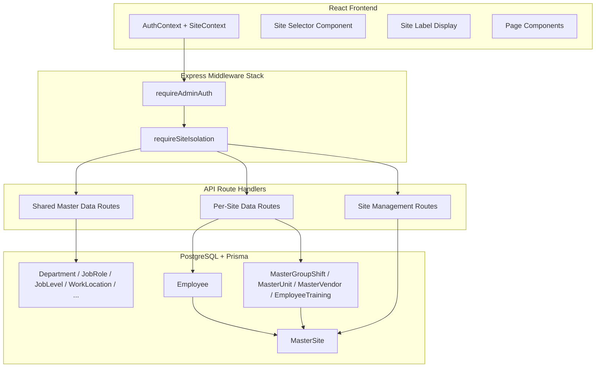
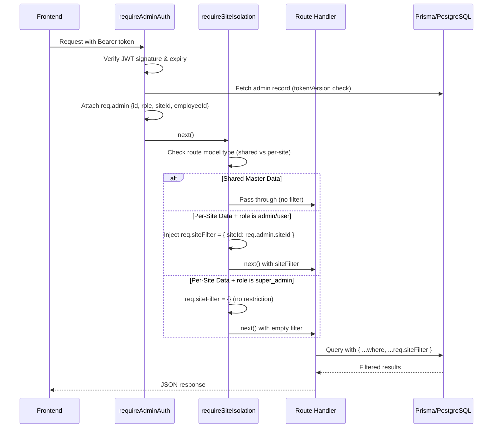

# Design Document: Multi-Tenant Site Isolation

## Overview

This design implements site-based multi-tenancy for Aplikasi Hub Karyawan, enabling data isolation between operational Sites (e.g., CLC, future mining/industrial locations). The architecture introduces a `MasterSite` entity as the tenant boundary, extends the existing role system to include site context, and adds middleware-level query filtering to enforce isolation transparently across all API endpoints.

**Key Design Decisions:**
1. **Middleware-based filtering** over per-route manual filtering — reduces code duplication and prevents accidental data leaks
2. **JWT-embedded site context** over per-request DB lookups — eliminates N+1 auth queries and enables stateless verification
3. **Shared master data exemption** — Department, JobRole, JobLevel, WorkLocation, MasterDokPkb, MasterDokKaryawan, MasterCutiKaryawan, MasterHoliday remain global to avoid data duplication
4. **Single migration with transaction** — ensures atomic schema change with safe rollback capability

## Architecture

### High-Level System Diagram



### Request Flow Sequence



## Components and Interfaces

### 1. MasterSite Model & CRUD API

**File:** `server/routes/sites.js`

```javascript
// POST /api/master/sites — Create a new site (Super Admin only)
// GET /api/master/sites — List all sites with counts (Super Admin only)
// PUT /api/master/sites/:id — Update site name (Super Admin only)
// DELETE /api/master/sites/:id — Delete site if no references (Super Admin only)
```

**Validation Schema (Yup):**
```javascript
const siteNameSchema = yup.object({
  name: yup.string()
    .trim()
    .min(1, 'Nama site wajib diisi.')
    .max(100, 'Nama site maksimal 100 karakter.')
    .required('Nama site wajib diisi.'),
});
```

**Route Guard:**
```javascript
function requireSuperAdmin(req, res, next) {
  if (req.admin.role !== 'super_admin') {
    return res.status(403).json({
      message: 'Akses ditolak. Hanya Super Admin yang dapat mengelola Site.',
    });
  }
  return next();
}
```

### 2. Site Isolation Middleware

**File:** `server/middleware/requireSiteIsolation.js`

The middleware is a factory function that accepts configuration specifying which models are per-site and which are shared.

```javascript
/**
 * Creates site isolation middleware for a specific route context.
 * @param {Object} options
 * @param {'per-site'|'shared'} options.modelType - Whether the route handles per-site or shared data
 * @returns {Function} Express middleware
 */
function requireSiteIsolation({ modelType = 'per-site' } = {}) {
  return function siteIsolationMiddleware(req, res, next) {
    const { role, siteId } = req.admin;

    // Shared master data: no filtering needed
    if (modelType === 'shared') {
      req.siteFilter = {};
      return next();
    }

    // Super admin: no site restriction
    if (role === 'super_admin') {
      req.siteFilter = {};
      req.isSuperAdmin = true;
      return next();
    }

    // Site-scoped admin: validate siteId exists
    if (siteId == null) {
      return res.status(403).json({
        message: 'Akses ditolak. Admin belum memiliki site yang ditugaskan.',
      });
    }

    // Inject site filter for all downstream queries
    req.siteFilter = { siteId };
    req.isSuperAdmin = false;
    return next();
  };
}
```

**Usage in route registration:**
```javascript
// Per-site routes
app.use('/api/master/employees', requireAdminAuth, requireSiteIsolation({ modelType: 'per-site' }), employeesRouter);
app.use('/api/master/group-shifts', requireAdminAuth, requireSiteIsolation({ modelType: 'per-site' }), groupShiftsRouter);

// Shared master data routes
app.use('/api/master', requireAdminAuth, requireSiteIsolation({ modelType: 'shared' }), masterDataRouter);
```

### 3. Enhanced Admin Auth Middleware

**File:** `server/middleware/requireAdminAuth.js` (modified)

The existing middleware is extended to attach `siteId` from the admin record to `req.admin`:

```javascript
req.admin = {
  id: admin.id,
  role: admin.role,
  employeeId: admin.employeeId,
  siteId: admin.siteId ?? null,  // NEW: site context from DB
  employee: admin.employee,
};
```

### 4. JWT Token Enhancement

**File:** `server/lib/adminSession.js` (modified)

The `createAdminAccessToken` function is extended to include `siteId`:

```javascript
function createAdminAccessToken(admin) {
  const issuedAt = Math.floor(Date.now() / 1000);
  const payload = {
    sub: String(admin.id),
    employeeId: admin.employeeId,
    role: admin.role,
    siteId: admin.siteId ?? null,  // NEW: null for super_admin
    tokenVersion: typeof admin.tokenVersion === 'number' ? admin.tokenVersion : 0,
    type: 'admin-access',
    iat: issuedAt,
    exp: issuedAt + TOKEN_TTL_SECONDS,
  };
  // ... sign and return
}
```

The `verifyAdminAccessToken` function adds site context validation:

```javascript
// After standard validation...
if ((payload.role === 'admin' || payload.role === 'user') && payload.siteId == null) {
  throw Object.assign(new Error('Konteks site tidak valid.'), { statusCode: 401 });
}
```

### 5. Site-Aware Route Handler Pattern

All per-site route handlers follow this pattern for queries:

```javascript
// LIST: Apply site filter to where clause
router.get('/', withAsync(async (req, res) => {
  const records = await prisma.employee.findMany({
    where: { ...req.siteFilter, /* other filters */ },
    include: { site: true },
  });
  return res.json(records);
}));

// DETAIL: Verify record belongs to admin's site
router.get('/:id', withAsync(async (req, res) => {
  const record = await prisma.employee.findUnique({ where: { id: Number(req.params.id) } });
  if (!record) return res.status(404).json({ message: 'Data tidak ditemukan.' });

  if (!req.isSuperAdmin && record.siteId !== req.admin.siteId) {
    return res.status(403).json({
      message: 'Akses ditolak. Data tidak termasuk dalam site Anda.',
    });
  }
  return res.json(record);
}));

// CREATE: Auto-assign siteId for site-scoped admins
router.post('/', withAsync(async (req, res) => {
  let siteId;
  if (req.isSuperAdmin) {
    siteId = req.body.siteId;
    if (!siteId) return res.status(400).json({ message: 'siteId wajib diisi.' });
    // Validate siteId exists
    const site = await prisma.masterSite.findUnique({ where: { id: siteId } });
    if (!site) return res.status(400).json({ message: 'Site tidak valid.' });
  } else {
    siteId = req.admin.siteId;
  }
  const record = await prisma.employee.create({ data: { ...req.body, siteId } });
  return res.status(201).json(record);
}));

// UPDATE: Preserve siteId, verify ownership
router.put('/:id', withAsync(async (req, res) => {
  const record = await prisma.employee.findUnique({ where: { id: Number(req.params.id) } });
  if (!record) return res.status(404).json({ message: 'Data tidak ditemukan.' });

  if (!req.isSuperAdmin && record.siteId !== req.admin.siteId) {
    return res.status(403).json({
      message: 'Akses ditolak. Data tidak termasuk dalam site Anda.',
    });
  }

  const { siteId: _ignored, ...updateData } = req.body; // Strip siteId from payload
  const updated = await prisma.employee.update({
    where: { id: record.id },
    data: updateData,
  });
  return res.json(updated);
}));
```

### 6. Frontend Site Context

**New File:** `src/contexts/siteContext.jsx`

```javascript
// Provides site context to the entire app
// - For site-scoped admins: fixed site from JWT
// - For super_admin: selectable site with "All Sites" default

const SiteContext = createContext(null);

function SiteProvider({ children }) {
  const { user } = useAuth();
  const [selectedSiteId, setSelectedSiteId] = useState(null); // null = "All Sites"

  const value = useMemo(() => ({
    currentSiteId: user?.role === 'super_admin' ? selectedSiteId : user?.siteId,
    siteName: user?.siteName || null,
    isSuperAdmin: user?.role === 'super_admin',
    selectedSiteId,
    setSelectedSiteId,
  }), [user, selectedSiteId]);

  return <SiteContext.Provider value={value}>{children}</SiteContext.Provider>;
}
```

**Site Selector Component (Super Admin):**
- Rendered in AppBar when role is `super_admin`
- Fetches sites from `GET /api/master/sites`
- Persists selection in sessionStorage
- Passes `siteId` query parameter on API calls when a specific site is selected

**Site Label Component (Site Admin):**
- Rendered in AppBar when role is `admin` or `user`
- Displays the site name from the auth context (decoded from JWT or login response)

### 7. Leave Approval Site Isolation

**File:** `server/lib/leaveApprovalWorkflow.js` (modified)

The approver resolution logic is extended with a site filter:

```javascript
async function findEligibleApprover(stageType, employee) {
  const siteId = employee.siteId;

  // All approver queries include site filter
  const approver = await prisma.employee.findFirst({
    where: {
      siteId,  // Must be from same site
      // ... existing stage-specific criteria
    },
  });

  if (!approver) {
    throw Object.assign(
      new Error(`Tidak ada approver yang tersedia untuk site karyawan.`),
      { statusCode: 400 }
    );
  }

  return approver;
}
```

### 8. Global Search Site Scoping

**File:** `server/routes/globalSearch.js` (modified)

Employee-related queries receive the site filter:

```javascript
// For site-scoped admins, add siteId filter to employee-related queries
const employeeSiteFilter = req.isSuperAdmin ? {} : { siteId: req.admin.siteId };

const employees = await prisma.employee.findMany({
  where: { ...employeeSiteFilter, OR: [...] },
});

// For super_admin, include site name in subtitle
subtitle: req.isSuperAdmin ? `${item.site?.name || '-'} | ${item.employeeNo}` : item.employeeNo,
```

### 9. Notification Site Scoping

**File:** `server/routes/notifications.js` (modified)

Notification queries filter by employee's siteId:

```javascript
const employeeSiteFilter = req.isSuperAdmin
  ? {}
  : { employee: { siteId: req.admin.siteId } };

// Applied to all notification source queries
const expiringCerts = await prisma.employeeLicenseCertification.findMany({
  where: { ...employeeSiteFilter, expiryDate: { lte: thresholdDate } },
});
```

## Data Models

### New Model: MasterSite

```prisma
model MasterSite {
  id        Int      @id @default(autoincrement())
  name      String   @unique @db.VarChar(100)
  createdAt DateTime @default(now())
  updatedAt DateTime @updatedAt

  employees      Employee[]
  admins         MasterAdmin[]
  groupShifts    MasterGroupShift[]
  units          MasterUnit[]
  vendors        MasterVendor[]
  trainings      EmployeeTraining[]

  @@map("master_sites")
}
```

### Modified Model: Employee

```prisma
model Employee {
  // ... existing fields ...
  siteId Int          // NEW: replaces siteDiv
  site   MasterSite   @relation(fields: [siteId], references: [id], onDelete: Restrict, onUpdate: Cascade)
  // REMOVED: siteDiv String @default("CLC") @db.VarChar(100)

  @@index([siteId])   // NEW index
}
```

### Modified Model: MasterAdmin

```prisma
model MasterAdmin {
  // ... existing fields ...
  siteId   Int?         // NEW: nullable (null = super_admin)
  site     MasterSite?  @relation(fields: [siteId], references: [id], onDelete: SetNull, onUpdate: Cascade)

  @@index([siteId])    // NEW index
}
```

### Modified Model: MasterGroupShift

```prisma
model MasterGroupShift {
  // ... existing fields ...
  siteId Int          // NEW
  site   MasterSite   @relation(fields: [siteId], references: [id], onDelete: Restrict, onUpdate: Cascade)

  @@index([siteId])   // NEW index
}
```

### Modified Model: MasterUnit

```prisma
model MasterUnit {
  // ... existing fields ...
  siteId Int          // NEW
  site   MasterSite   @relation(fields: [siteId], references: [id], onDelete: Restrict, onUpdate: Cascade)

  @@index([siteId])   // NEW index
}
```

### Modified Model: MasterVendor

```prisma
model MasterVendor {
  // ... existing fields ...
  siteId Int          // NEW
  site   MasterSite   @relation(fields: [siteId], references: [id], onDelete: Restrict, onUpdate: Cascade)

  @@index([siteId])   // NEW index
}
```

### Modified Model: EmployeeTraining

```prisma
model EmployeeTraining {
  // ... existing fields ...
  siteId Int          // NEW
  site   MasterSite   @relation(fields: [siteId], references: [id], onDelete: Restrict, onUpdate: Cascade)

  @@index([siteId])   // NEW index
}
```

### Migration Strategy

The migration executes within a single transaction:

```sql
BEGIN;

-- 1. Create MasterSite table
CREATE TABLE "master_sites" (
  "id" SERIAL PRIMARY KEY,
  "name" VARCHAR(100) NOT NULL UNIQUE,
  "created_at" TIMESTAMP(3) NOT NULL DEFAULT CURRENT_TIMESTAMP,
  "updated_at" TIMESTAMP(3) NOT NULL
);

-- 2. Seed initial site
INSERT INTO "master_sites" ("name", "updated_at") VALUES ('CLC', CURRENT_TIMESTAMP);

-- 3. Add siteId columns (nullable initially)
ALTER TABLE "employees" ADD COLUMN "site_id" INTEGER;
ALTER TABLE "master_group_shifts" ADD COLUMN "site_id" INTEGER;
ALTER TABLE "master_units" ADD COLUMN "site_id" INTEGER;
ALTER TABLE "master_vendors" ADD COLUMN "site_id" INTEGER;
ALTER TABLE "employee_trainings" ADD COLUMN "site_id" INTEGER;
ALTER TABLE "master_admins" ADD COLUMN "site_id" INTEGER;

-- 4. Assign all existing records to CLC
UPDATE "employees" SET "site_id" = (SELECT id FROM "master_sites" WHERE name = 'CLC');
UPDATE "master_group_shifts" SET "site_id" = (SELECT id FROM "master_sites" WHERE name = 'CLC');
UPDATE "master_units" SET "site_id" = (SELECT id FROM "master_sites" WHERE name = 'CLC');
UPDATE "master_vendors" SET "site_id" = (SELECT id FROM "master_sites" WHERE name = 'CLC');
UPDATE "employee_trainings" SET "site_id" = (SELECT id FROM "master_sites" WHERE name = 'CLC');
UPDATE "master_admins" SET "site_id" = (SELECT id FROM "master_sites" WHERE name = 'CLC')
  WHERE "role" = 'admin';

-- 5. Set lowest-id admin as super_admin
UPDATE "master_admins" SET "role" = 'super_admin', "site_id" = NULL
  WHERE "id" = (SELECT MIN("id") FROM "master_admins");

-- 6. Apply NOT NULL constraints (except MasterAdmin which stays nullable)
ALTER TABLE "employees" ALTER COLUMN "site_id" SET NOT NULL;
ALTER TABLE "master_group_shifts" ALTER COLUMN "site_id" SET NOT NULL;
ALTER TABLE "master_units" ALTER COLUMN "site_id" SET NOT NULL;
ALTER TABLE "master_vendors" ALTER COLUMN "site_id" SET NOT NULL;
ALTER TABLE "employee_trainings" ALTER COLUMN "site_id" SET NOT NULL;

-- 7. Add foreign key constraints
ALTER TABLE "employees" ADD CONSTRAINT "employees_site_id_fkey"
  FOREIGN KEY ("site_id") REFERENCES "master_sites"("id") ON DELETE RESTRICT ON UPDATE CASCADE;
-- ... (similar for other tables, MasterAdmin uses ON DELETE SET NULL)

-- 8. Drop legacy column
ALTER TABLE "employees" DROP COLUMN "site_div";

-- 9. Add indexes
CREATE INDEX "employees_site_id_idx" ON "employees"("site_id");
-- ... (similar for other tables)

COMMIT;
```

### Login Response Enhancement

The login response is extended to include site context:

```javascript
// POST /api/auth/login response
{
  message: 'Login berhasil.',
  tokenType: 'Bearer',
  accessToken: token,
  expiresAt,
  user: {
    id: admin.id,
    role: admin.role,
    employeeId: admin.employeeId,
    name: admin.employee.fullName,
    nik: admin.employee.employeeNo,
    siteId: admin.siteId,         // NEW
    siteName: admin.site?.name,   // NEW
  },
}
```

### API Endpoints Summary

| Endpoint | Method | Auth | Site Isolation |
|----------|--------|------|----------------|
| `/api/master/sites` | GET/POST/PUT/DELETE | Super Admin only | N/A (manages sites) |
| `/api/master/employees` | ALL | Admin Auth | Per-site filtered |
| `/api/master/group-shifts` | ALL | Admin Auth | Per-site filtered |
| `/api/master/admins` | ALL | Admin Auth | Super Admin for assignment |
| `/api/master` (departments, etc.) | ALL | Admin Auth | Shared (no filter) |
| `/api/data-karyawan/*` | ALL | Admin Auth | Per-site filtered |
| `/api/data-unit/*` | ALL | Admin Auth | Per-site filtered |
| `/api/global-search` | GET | Admin Auth | Per-site for employee data |
| `/api/notifications` | ALL | Admin Auth | Per-site filtered |

## Correctness Properties

*A property is a characteristic or behavior that should hold true across all valid executions of a system — essentially, a formal statement about what the system should do. Properties serve as the bridge between human-readable specifications and machine-verifiable correctness guarantees.*

### Property 1: Site Name Validation

*For any* string input as a site name, the system SHALL accept it if and only if it contains at least 1 non-whitespace character and is at most 100 characters in length; otherwise it SHALL reject with a validation error.

**Validates: Requirements 1.1, 9.1**

### Property 2: Site Name Uniqueness

*For any* two MasterSite creation or update operations with the same site name (case-sensitive), the second operation SHALL be rejected with an error indicating the name is already in use.

**Validates: Requirements 1.3, 1.4**

### Property 3: Referential Integrity on Site Deletion

*For any* MasterSite record, deletion SHALL succeed if and only if zero Employee, MasterAdmin, MasterGroupShift, MasterUnit, MasterVendor, and EmployeeTraining records reference that site's id; otherwise deletion SHALL be rejected.

**Validates: Requirements 1.5, 1.6, 9.4, 9.6**

### Property 4: Role Value Validation

*For any* string value assigned to the MasterAdmin `role` field, the system SHALL accept it if and only if it is one of "super_admin", "admin", or "user"; otherwise it SHALL reject with a validation error.

**Validates: Requirements 3.1, 3.6**

### Property 5: Site-Scoped Admin Requires Non-Null SiteId

*For any* MasterAdmin record with role "admin" or "user", the `siteId` field SHALL be a non-null integer referencing a valid MasterSite record; if `siteId` is null or missing, the creation or update SHALL be rejected.

**Validates: Requirements 3.3, 3.4, 3.5, 10.4**

### Property 6: Site-Scoped Query Filtering

*For any* authenticated admin with role "admin" or "user" and assigned `siteId` S, and *for any* query to a per-site model (Employee, MasterGroupShift, MasterUnit, MasterVendor, EmployeeTraining), the result set SHALL contain only records where `siteId` equals S.

**Validates: Requirements 3.7, 5.1, 5.5, 7.1, 7.3, 7.5, 7.7, 11.1**

### Property 7: Super Admin Bypass

*For any* authenticated admin with role "super_admin" and *for any* query to any model, the result set SHALL contain records from all Sites without any site-based filtering applied.

**Validates: Requirements 3.2, 3.8, 5.2, 8.6, 11.6, 14.3, 15.3**

### Property 8: JWT Site Context Correctness

*For any* MasterAdmin record, the generated JWT SHALL contain `siteId` equal to the admin's database `siteId` value (null for super_admin, integer for admin/user), `role` equal to the admin's database `role` value, and all required fields (sub, employeeId, role, siteId, tokenVersion, type, iat, exp).

**Validates: Requirements 4.1, 4.2, 4.3**

### Property 9: Token Validation Rejects Invalid Tokens

*For any* token that is missing, has an invalid signature, is expired, or has role "admin"/"user" with null siteId, the middleware SHALL reject the request with HTTP 401.

**Validates: Requirements 4.5, 4.6, 4.7**

### Property 10: Cross-Site Access Denied

*For any* authenticated admin with role "admin" or "user" and assigned `siteId` S, and *for any* record R in a per-site model where R.siteId ≠ S, any read, update, or delete operation on R SHALL be rejected with HTTP 403.

**Validates: Requirements 5.3, 5.4, 7.11, 11.2, 11.3**

### Property 11: Shared Master Data Accessible Without Site Filter

*For any* authenticated admin (regardless of role or siteId) and *for any* query to a shared master data model (Department, JobRole, JobLevel, WorkLocation, MasterDokPkb, MasterDokKaryawan, MasterCutiKaryawan, MasterHoliday), the result set SHALL include all records without any site-based filtering.

**Validates: Requirements 5.6, 6.1, 6.4, 14.2**

### Property 12: Auto-Assignment of SiteId on Creation

*For any* authenticated admin with role "admin" or "user" and assigned `siteId` S, and *for any* create operation on a per-site model, the resulting record's `siteId` SHALL equal S regardless of any `siteId` value provided in the request payload.

**Validates: Requirements 7.2, 7.4, 7.6, 7.8, 11.4, 11.5**

### Property 13: SiteId Preserved on Update by Site-Scoped Admin

*For any* authenticated admin with role "admin" or "user" and *for any* update operation on a per-site record, the record's `siteId` SHALL remain unchanged after the update, regardless of any `siteId` value provided in the update payload.

**Validates: Requirements 7.12**

### Property 14: Super Admin Requires Explicit SiteId for Per-Site Creation

*For any* authenticated super_admin and *for any* create operation on a per-site model, the request SHALL be rejected with HTTP 400 if the payload does not contain a `siteId` that references an existing MasterSite record.

**Validates: Requirements 7.9, 7.10, 11.7, 11.8**

### Property 15: Leave Approval Site Boundary

*For any* leave request from an employee with `siteId` S, all assigned approvers SHALL have `siteId` equal to S; if an approver with a different `siteId` is referenced, the assignment SHALL be rejected.

**Validates: Requirements 8.1, 8.3, 8.5**

### Property 16: Site Management Restricted to Super Admin

*For any* authenticated admin with role "admin" or "user", any request to `/api/master/sites` endpoints SHALL be rejected with HTTP 403.

**Validates: Requirements 9.5, 10.3**

### Property 17: Token Version Increment on Site Change

*For any* MasterAdmin whose `siteId` is changed via a Super Admin assignment operation, the admin's `tokenVersion` SHALL be incremented by exactly 1 compared to its value before the operation.

**Validates: Requirements 10.2**

### Property 18: Promotion to Super Admin Nullifies SiteId

*For any* MasterAdmin whose role is changed to "super_admin", the resulting record's `siteId` SHALL be null.

**Validates: Requirements 10.5**

### Property 19: Global Search Site Scoping

*For any* authenticated admin with role "admin" or "user" and assigned `siteId` S, and *for any* global search query, all employee-related results (employees, guidance records, warning letters, leave records, license certifications) SHALL reference only employees whose `siteId` equals S.

**Validates: Requirements 14.1, 14.5**

### Property 20: Notification Site Scoping

*For any* authenticated admin with role "admin" or "user" and assigned `siteId` S, all returned notifications SHALL relate only to employees whose `siteId` equals S, and mark-as-read operations SHALL only succeed for notifications belonging to employees within site S.

**Validates: Requirements 15.1, 15.2, 15.5**

## Error Handling

### HTTP Status Code Strategy

| Scenario | Status | Message (Indonesian) |
|----------|--------|---------------------|
| Missing/invalid token | 401 | "Akses ditolak. Silakan login admin terlebih dahulu." |
| Token expired | 401 | "Sesi login sudah berakhir. Silakan login kembali." |
| Invalid site context in token | 401 | "Konteks site tidak valid." |
| Site-scoped admin accessing other site's data | 403 | "Akses ditolak. Data tidak termasuk dalam site Anda." |
| Admin with no site assignment | 403 | "Akses ditolak. Admin belum memiliki site yang ditugaskan." |
| Non-super_admin accessing site management | 403 | "Akses ditolak. Hanya Super Admin yang dapat mengelola Site." |
| Non-super_admin managing admin assignments | 403 | "Akses ditolak. Hanya Super Admin yang dapat mengelola penugasan Site." |
| Site name empty or too long | 400 | "Nama site wajib diisi." / "Nama site maksimal 100 karakter." |
| Duplicate site name | 409 | "Nama site sudah digunakan." |
| Delete site with references | 409 | "Site tidak dapat dihapus karena masih memiliki data terkait." |
| Site not found | 404 | "Site tidak ditemukan." |
| Missing siteId for per-site creation (super_admin) | 400 | "siteId wajib diisi dan harus mereferensikan Site yang valid." |
| Invalid siteId reference | 400 | "Site tidak valid." |
| Site required for admin/user role | 400 | "Site wajib dipilih untuk role yang dipilih." |
| No approver available in site | 400 | "Tidak ada approver yang tersedia untuk site karyawan." |
| Leave approver site mismatch | 400 | "Approver tidak berada dalam site yang sama dengan pemohon cuti." |
| Super admin self-demotion | 400 | "Super Admin tidak dapat menurunkan role diri sendiri." |

### Error Response Format

All error responses follow the existing application pattern:

```javascript
{
  message: "Human-readable error message in Indonesian"
}
```

### Prisma Error Handling

The existing global error handler already handles:
- `P2002` (unique constraint) → 409
- `P2003` (foreign key constraint) → 409

Additional handling for site-specific scenarios:
- `P2025` (record not found during update/delete) → 404 with "Site tidak ditemukan."

## Testing Strategy

### Property-Based Testing

**Library:** [fast-check](https://github.com/dubzzz/fast-check) (JavaScript PBT library, well-maintained, works with Vitest)

**Configuration:**
- Minimum 100 iterations per property test
- Each test tagged with: `Feature: multi-tenant-site-isolation, Property {N}: {description}`

**Applicable Properties for PBT:**

The following properties are suitable for property-based testing because they involve pure validation logic or deterministic filtering behavior that varies meaningfully with input:

1. **Property 1** (Site name validation) — Generate random strings, verify accept/reject boundary
2. **Property 2** (Site name uniqueness) — Generate random name pairs, verify duplicate detection
3. **Property 4** (Role validation) — Generate random strings, verify only 3 valid values accepted
4. **Property 5** (Site-scoped admin requires siteId) — Generate admin records with various role/siteId combinations
5. **Property 6** (Site-scoped query filtering) — Generate multi-site data sets, verify filtering correctness
6. **Property 7** (Super admin bypass) — Generate multi-site data, verify no filtering for super_admin
7. **Property 8** (JWT site context) — Generate admin records, verify token payload structure
8. **Property 9** (Token validation) — Generate invalid tokens (malformed, expired, bad signature)
9. **Property 10** (Cross-site access denied) — Generate cross-site access attempts
10. **Property 12** (Auto-assignment of siteId) — Generate payloads with various siteId values
11. **Property 13** (SiteId preserved on update) — Generate update payloads with different siteId values
12. **Property 15** (Leave approval site boundary) — Generate employee/approver pairs across sites
13. **Property 17** (Token version increment) — Generate site change operations
14. **Property 19** (Global search site scoping) — Generate multi-site search data

### Unit Tests (Example-Based)

Focus areas:
- Site CRUD endpoint responses (specific examples for create, list, update, delete)
- Login response structure with site context
- Frontend component rendering (Site selector, site label)
- Migration rollback behavior
- Edge cases: super_admin self-demotion, no approver in site

### Integration Tests

Focus areas:
- Full migration execution on test database
- End-to-end request flow: login → token → middleware → filtered response
- Leave approval workflow with multi-site employees
- Global search with mixed site data
- Notification generation and filtering

### Test File Organization

```
app-karyawan/
├── src/test/
│   ├── siteIsolation.property.test.js    # PBT: Properties 1,2,4,5,6,7,8,9,10,12,13
│   ├── leaveApproval.property.test.js    # PBT: Property 15
│   ├── globalSearch.property.test.js     # PBT: Property 19
│   └── siteManagement.test.js            # Unit: CRUD, auth guards
├── server/
│   └── __tests__/
│       ├── siteIsolationMiddleware.test.js
│       ├── adminSession.test.js
│       └── migration.integration.test.js
```

